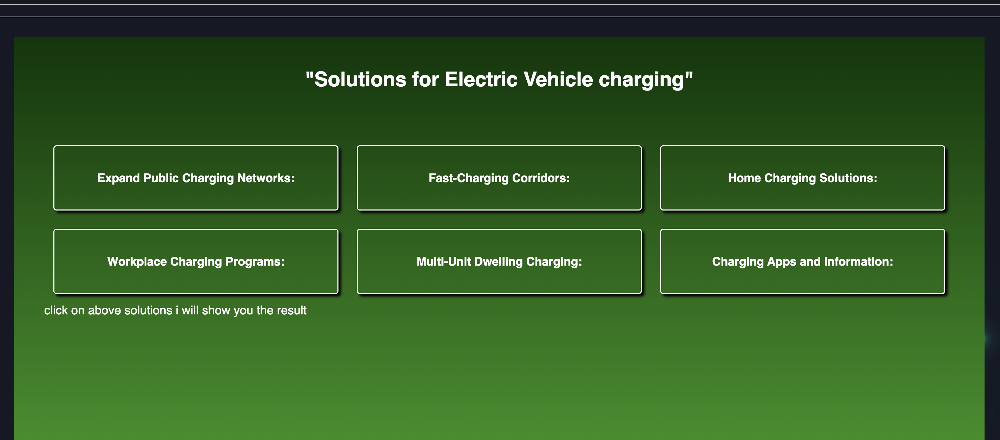
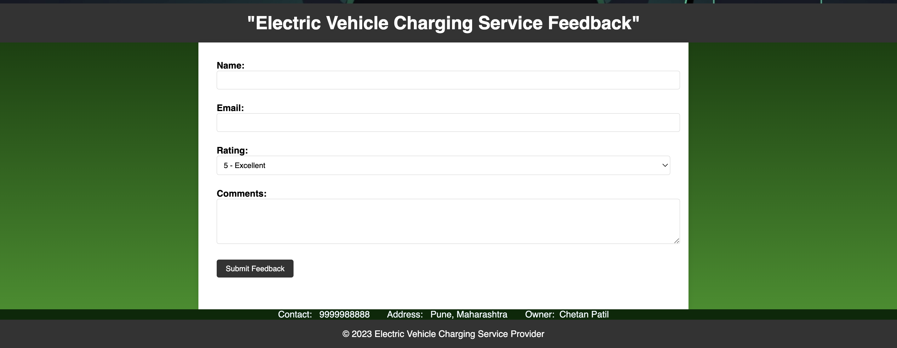

# Project Title: Electric Vehicle Charging Station Finder

# Project Description:
Our project, the "Electric Vehicle Charging Station Finder," is a web-based application developed using HTML, CSS, and JavaScript. It assists electric vehicle (EV) owners in locating nearby charging stations with ease. The user-friendly interface allows users to input their current location or destination and receive real-time recommendations for the closest available charging stations. The system incorporates responsive design principles to ensure compatibility across devices. This project promotes sustainable transportation by facilitating convenient access to EV charging infrastructure.

# link:  https://git0chetan.github.io/Electric-vehicle/

# Some ScreenShots

